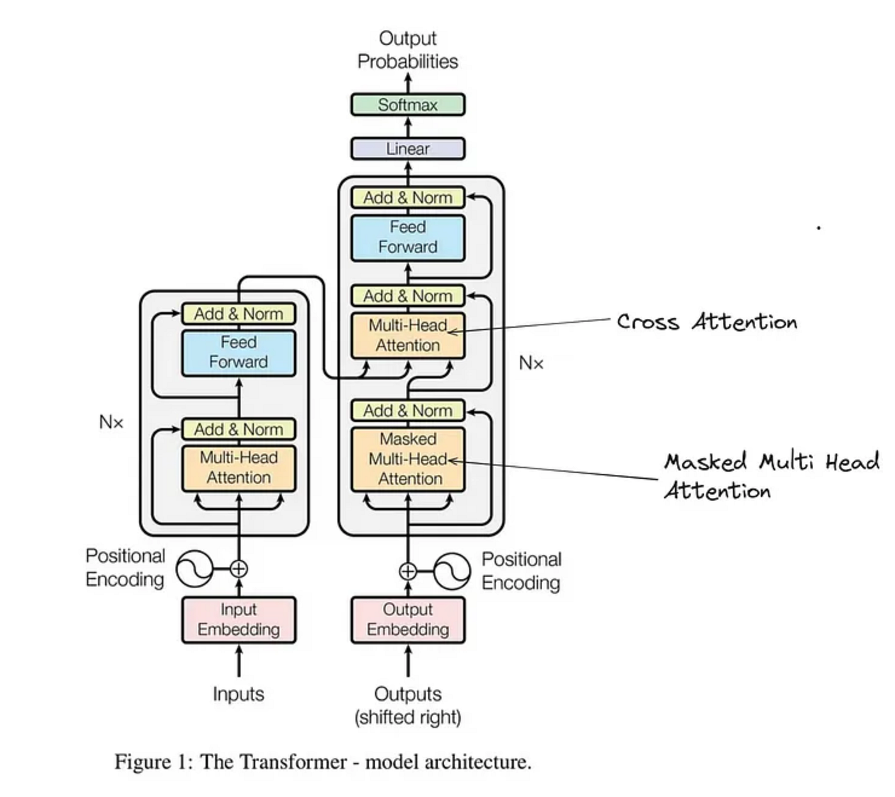
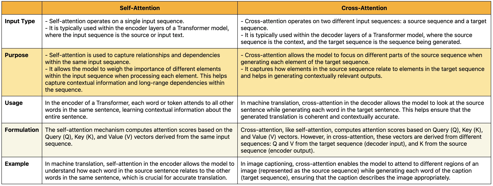

# Cross Attention in Transformers

### What is Cross Attention?

**Cross Attention** is an attention mechanism where **one sequence attends to another sequence**.

In the Transformer architecture:

- **Decoder queries the encoder outputs**
  
- This allows the decoder to **use information from the input sentence while generating output words**

Simple definition:

**Cross-attention allows the decoder to focus on relevant parts of the encoder output when generating each word.**

### Why Cross Attention is Needed in Transformers?

In tasks like **machine translation**, the model must:

1. Understand the **input sentence**
   
2. Generate the **output sentence**

hum dost he..... suppose, i need to predict the hindi word 'dost', then it depends on what generated till now(Hum) and what is the relationship with input sequence(we are friends).To understand the similarity between 2 difference sequence(Eng and hindi) we do cross attention between Encoder output(English context embedding) and decoder masked multi head attention(output).

Query-from previous masked part

Key,value- from Encoder output

Example:

English sentence (input):

We are friends

Hindi sentence (output):

हम दोस्त हैं

The **encoder processes the English sentence**, while the **decoder generates Hindi words**.But the decoder must know **which input words are important** for each generated word.Cross attention solves this problem.

Example:

| Decoder Word | Focus on Encoder Word |

|---|---|

| हम | We |

| दोस्त | friends |

| हैं | are |

So the decoder **looks at encoder outputs** while generating each word.

### Cross Attention Mechanism

Cross attention is similar to self-attention but **queries come from the decoder** while **keys and values come from the encoder**.

Attention formula:

Attention(Q,K,V) = softmax(QKᵀ / √d) V

For **cross attention**:

Q = Decoder hidden states
K = Encoder outputs
V = Encoder outputs

So the decoder **asks questions (Query)** about the encoder information.

### Step-by-Step Cross Attention Computation

Suppose the input sentence is:

We are friends

**Step 1 — Encoder Processing**

Encoder converts words into contextual vectors:

We → e1

are → e2

friends → e3

Encoder output matrix:

E = [e1, e2, e3]

These become **Keys and Values**.

**Step 2 — Decoder Generates Query**

Suppose the decoder is generating the first word:

<START> 

The decoder produces a query vector:

q1

**Step 3 — Attention Scores**

The query compares with encoder keys:

score1 = q1 · k1

score2 = q1 · k2

score3 = q1 · k3

Example scores:

[1.2, 0.4, 0.2]

**Step 4 — Softmax**

Softmax converts scores into probabilities:

[0.65, 0.22, 0.13]

This means the decoder focuses mostly on "We".

**Step 5 — Context Vector**

Weighted sum of encoder values:

context = 0.65*v1 + 0.22*v2 + 0.13*v3

This context helps the decoder generate the correct word.

### Example output:

Decoder: "Hum" → Query → "Which English words should I focus on?"

                         ↓

              [Encoder: "We", "are", "friends"] → Keys & Values

                         ↓

              Attention weights → Context for next word

Step-by-Step Calculation

Step 1: We Have Two Sources

Encoder outputs (from English sentence):

E1 = "We"      → [0.8, 0.1, 0.5]  (Key1, Value1)

E2 = "are"     → [0.3, 0.9, 0.2]  (Key2, Value2)

E3 = "friends" → [0.4, 0.2, 0.9]  (Key3, Value3)

Decoder current state (for "Hum"):

D = "Hum" → [0.7, 0.3, 0.6]  (Query)

Step 2: Compute Attention Scores

Query × Key (dot product) for each English word:

Score with "We" = [0.7,0.3,0.6] · [0.8,0.1,0.5] 

                = (0.7×0.8)+(0.3×0.1)+(0.6×0.5)

                = 0.56 + 0.03 + 0.30 = 0.89

Score with "are" = [0.7,0.3,0.6] · [0.3,0.9,0.2]

                 = 0.21 + 0.27 + 0.12 = 0.60

Score with "friends" = [0.7,0.3,0.6] · [0.4,0.2,0.9]

                      = 0.28 + 0.06 + 0.54 = 0.88

Raw scores: [0.89, 0.60, 0.88]

Step 3: Apply Softmax (Get Probabilities)

Sum of exponentials = e^0.89 + e^0.60 + e^0.88
                    = 2.43 + 1.82 + 2.41 = 6.66

Attention weight for "We" = e^0.89/6.66 = 2.43/6.66 = 0.36

Attention weight for "are" = e^0.60/6.66 = 1.82/6.66 = 0.27

Attention weight for "friends" = e^0.88/6.66 = 2.41/6.66 = 0.37

Attention weights: [0.36, 0.27, 0.37] (sum = 1.0)

Step 4: Weighted Sum of Values

Values (same as Keys in this simple example):

V1 = "We" = [0.8, 0.1, 0.5]

V2 = "are" = [0.3, 0.9, 0.2]

V3 = "friends" = [0.4, 0.2, 0.9]

Weighted sum:

text
Position 1: (0.36×0.8) + (0.27×0.3) + (0.37×0.4)

          = 0.288 + 0.081 + 0.148 = 0.517

Position 2: (0.36×0.1) + (0.27×0.9) + (0.37×0.2)

          = 0.036 + 0.243 + 0.074 = 0.353

Position 3: (0.36×0.5) + (0.27×0.2) + (0.37×0.9)

          = 0.18 + 0.054 + 0.333 = 0.567

Context vector = [0.517, 0.353, 0.567]

Step 5: Use Context to Predict Next Word(then feed forward part start)

Context + Decoder state → Predict next Hindi word

[0.517, 0.353, 0.567] + [0.7,0.3,0.6] → Neural Network → Vocabulary scores

Most likely next word: "hain" (are)

Visual Summary

Decoder: "Hum" (Query = [0.7,0.3,0.6])

              ↓

    ┌─────────────────────┐
    │  CROSS ATTENTION    │
    └─────────────────────┘

         ↓         ↓         ↓

    "We"        "are"     "friends"

  [0.8,0.1,0.5] [0.3,0.9,0.2] [0.4,0.2,0.9]

      ↑           ↑           ↑

    0.36         0.27        0.37
      
                  ↓

        Context = [0.52, 0.35, 0.57]

                  ↓

        Next word = "hain" (are)

### Difference between Cross and Self attention

