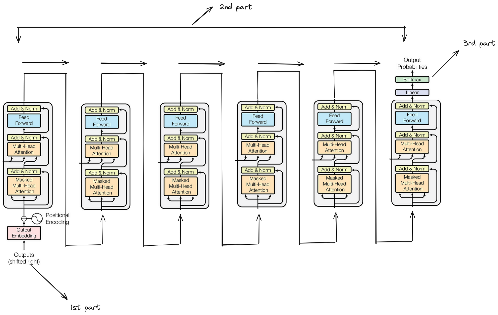

# Transformer Decoder Architecture.

Decoder is the part of a Transformer that generates the output sequence step-by-step using encoder information and previously generated words.

Encoder → understands the input sentence

Decoder → produces the output sentence

Example:

Input (English):

We are friends

Encoder processes it and creates context representations.

Decoder then generates:

Hum dost hain

### Decoder Components

Each decoder block contains:

Masked Self Attention
→ looks only at previous words

Cross Attention
→ connects decoder with encoder output

Feed Forward Network
→ transforms word representations

### Decoder Generation: Training vs Inference

The decoder generates the output sentence step-by-step, but the behavior is slightly different during **training** and **inference**.

Example translation:

English input (encoder):

We are friends

Target output (decoder):

Hum dost hain

###### 1. Decoder During Training

During training the **correct target sentence is already known**.

So the decoder uses **teacher forcing** and processes the entire sequence **in parallel**.

Training Data

Encoder Input : We are friends

Decoder Input : <START> Hum dost

Target Output : Hum dost hain

Meaning the model learns the following mappings:

| `<START>` | Hum |

|  'Hum` | dost |

|  'dost` | hain |

|  'hain' | end  |

**What Happens Internally**

The decoder receives:

<START> Hum dost

Masked attention ensures each position only sees **previous tokens**.So internally the decoder learns:

Position1 → predict Hum

Position2 → predict dost

Position3 → predict hain

Even though all predictions are computed **in one forward pass**, masking ensures **future words are hidden**.

So training is:

- **Non-autoregressive computation**
  
- **Parallel prediction**
  
- **Masked to avoid future information leakage**
  

##### 2. Decoder During Inference

During inference the **correct output sentence is unknown**.

So the decoder must **generate words sequentially**.

Step 1:

Input:

<START> 

Prediction: Hum

Step 2:

New input becomes:

<START> Hum

Prediction: dost

Step 3:

Input:

<START> Hum dost

Prediction: hain

Final Output:

Hum dost hain

Inference stops when:

<END> token appears, or

maximum length is reached.

### Example details for training:

English (Encoder Input): "We are friends"

Hindi (Target Output): "Hum dost hain <end>"

Encoder Input	"We are friends"	[245, 567, 891]

Decoder Input (shifted right)	<start> Hum dost hain	[1, 342, 678, 901]

Target Output (labels)	Hum dost hain <end>	[342, 678, 901, 2]

At Training: All inputs fed to decoder simultaneously (non-autoregressive)

##### 1. Input Preparation

4 parts exist: shifting,Tokenization,embedding,positional embedding.

**Vocabulary mapping**

<start> = 1, <end> = 2

Hum = 342, dost = 678, hain = 901

Decoder input tokens: [1, 342, 678, 901]

Target tokens: [342, 678, 901, 2]

**Embedding Lookup**

Word "Hum" (index 342) → [0.2, -0.5, 0.7, 0.1]

Word "dost" (index 678) → [0.3, 0.1, -0.2, 0.6]

Word "hain" (index 901) → [-0.1, 0.4, 0.5, -0.3]

<start> (index 1) → [0.0, 0.0, 0.1, 0.2]

**Positional Encoding Added**

Position 1 (<start>): [0.0+0.1, 0.0+0.3, 0.1-0.2, 0.2+0.4] = [0.1, 0.3, -0.1, 0.6]

Position 2 (Hum):     [0.2+0.2, -0.5+0.5, 0.7-0.1, 0.1+0.2] = [0.4, 0.0, 0.6, 0.3]

Position 3 (dost):    [0.3+0.3, 0.1+0.7, -0.2+0.0, 0.6-0.1] = [0.6, 0.8, -0.2, 0.5]

Position 4 (hain):    [-0.1+0.4, 0.4+0.9, 0.5+0.1, -0.3-0.3] = [0.3, 1.3, 0.6, -0.6]

##### 2. Masked Multi-Head Attention

Masking Prevents attending to future positions.

Attention Mask Matrix (4×4)

Position	Can attend to	Cannot attend to

1 (<start>)	    [1]	           [2,3,4]

2 (Hum)	       [1,2]	       [3,4]

3 (dost)	   [1,2,3]	        [4]

4 (hain)	  [1,2,3,4]	        []

Example: Position 3 ("dost") Calculation

Query from "dost" = [0.5, 0.2, 0.7] 

Attention scores with previous positions:

- With <start>: 0.3
  
- With "Hum": 0.7
  
- With itself "dost": 0.5
  
- With "hain": -inf (masked, not computed)

Softmax weights: [0.2, 0.5, 0.3, 0]

Output = weighted sum of values

##### 3. Cross Attention (Encoder-Decoder Attention)**
   
Encoder Outputs (from "We are friends")

E1("We") = K1[0.8,0.1,0.5], V1[0.8,0.1,0.5]

E2("are") = K2[0.3,0.9,0.2], V2[0.3,0.9,0.2]

E3("friends") = K3[0.4,0.2,0.9], V3[0.4,0.2,0.9]

For Position 2 ("Hum") - Predicting "dost"

Decoder state for "Hum" (after masked attention) = Q = [0.5, 0.2, 0.7]

Attention scores:

Q·K1 = 0.77 (We)

Q·K2 = 0.47 (are)

Q·K3 = 0.87 (friends) ← Highest!

Softmax weights: [0.30, 0.20, 0.50]

Context vector = 0.30×V1 + 0.20×V2 + 0.50×V3 = [0.44, 0.27, 0.61]

For Position 3 ("dost") - Predicting "hain"

Decoder state for "dost" = Q = [0.6, 0.3, 0.4]

Attention scores focus more on "are" and "friends"

Context vector = [0.38, 0.45, 0.52]

For Position 4 ("hain") - Predicting "<end>"

Decoder state for "hain" = Q = [0.2, 0.7, 0.3]

Attention scores distribute across all English words

Context vector = [0.41, 0.33, 0.46]

##### 4. Feed-Forward Network (FFN)

Same FFN applied to each position independently.

For Position 2 ("Hum") - After Cross Attention

Input to FFN = [0.44, 0.27, 0.61] (cross attention output)

Step 1: Linear (3→6)

[0.44,0.27,0.61] × W₁[3×6] + b₁ = [0.3, -0.5, 0.7, 0.2, -0.1, 0.4]

Step 2: ReLU activation

[0.3, 0, 0.7, 0.2, 0, 0.4] (negative to zero)

Step 3: Linear (6→3)

× W₂[6×3] + b₂ = [0.6, -0.2, 0.8]

Output = transformed representation for next layer

For Position 3 ("dost")

Input = [0.38, 0.45, 0.52]

After FFN = [0.5, 0.3, 0.7]

For Position 4 ("hain")

Input = [0.41, 0.33, 0.46]

After FFN = [0.4, 0.6, 0.5]

##### 5. Output Generation (Final Layer)

After N Decoder Blocks

Final decoder outputs:

Position 1 (<start>): [0.7, 0.1, 0.5]

Position 2 (Hum):     [0.6, -0.2, 0.8]

Position 3 (dost):    [0.5, 0.3, 0.7]

Position 4 (hain):    [0.4, 0.6, 0.5]

Linear Layer + Softmax (Vocabulary Size 10000)

For Position 2 (predicting "dost"):

Input = [0.6, -0.2, 0.8] × W_output[3×10000] + bias = scores[10000]

Top scores:

- Word 342 ("Hum"): 2.5 (already generated)
  
- Word 678 ("dost"): 8.7 ← Highest!
  
- Word 901 ("hain"): 3.2
  
- Word 2 ("<end>"): 0.5
  
- Others: lower

Softmax probabilities:

P(dost) = 0.85

P(hain) = 0.08

P(Hum) = 0.05

P(<end>) = 0.01

Others = 0.01

Selected: "dost" ✓

For Position 3 (predicting "hain"):

Input = [0.5, 0.3, 0.7]

Top scores:

- Word 901 ("hain"): 9.1 ← Highest!
  
- Word 678 ("dost"): 2.8
  
- Word 2 ("<end>"): 1.2

Selected: "hain" 

For Position 4 (predicting "<end>"):

Input = [0.4, 0.6, 0.5]

Top scores:

- Word 2 ("<end>"): 8.9 ← Highest
  
- Word 901 ("hain"): 2.1
  
- Word 342 ("Hum"): 0.8

Selected: "<end>" 

# Transformer Decoder Inference - Autoregressive Generation

Inference = Using a trained model to make predictions on new data

### What is Autoregressive?

Autoregressive = Generating one word at a time, feeding each new word back as input for the next prediction

Translation Task (Inference)

English (Encoder Input): "We are friends" (already processed by encoder)

Hindi to Generate: "Hum dost hain <end>"

**Step-by-Step Inference**

Initial State

Decoder starts with: [<start>]

Encoder outputs: [E1("We"), E2("are"), E3("friends")] (fixed)

**Step 1: Generate First Word "Hum"**

Input to Decoder: [<start>]

Masked Attention:

<start> attends only to itself

Cross Attention:

Query from <start> looks at encoder outputs

Highest attention on "We" (60%) and "friends" (30%)

FFN + Output Layer:

Vocabulary scores:

- "Hum": 8.5  ← Highest
  
- "main": 3.2
  
- "aap": 2.1

Selected: "Hum" ✓

New decoder input: [<start>, Hum]

**Step 2: Generate Second Word "dost"**

Input to Decoder: [<start>, Hum]

Masked Attention:

"Hum" attends to <start> and itself

Future words masked (none yet)

Cross Attention:

Query from "Hum" looks at encoder

Highest attention on "friends" (70%)

FFN + Output Layer:

Vocabulary scores:

- "dost": 9.2 ← Highest
  
- "log": 2.5
  
- "hain": 1.8

Selected: "dost" ✓

New decoder input: [<start>, Hum, dost]

**Step 3: Generate Third Word "hain"**

Input to Decoder: [<start>, Hum, dost]

Masked Attention:

"dost" attends to <start>, "Hum", and itself

Cross Attention:

Query from "dost" looks at encoder

Attention distributes across all English words

FFN + Output Layer:

Vocabulary scores:

- "hain": 8.9 ← Highest
  
- "hai": 3.4
  
- "the": 1.2

Selected: "hain" ✓

New decoder input: [<start>, Hum, dost, hain]

**Step 4: Generate Fourth Word "<end>"**

Input to Decoder: [<start>, Hum, dost, hain]

Masked Attention:

"hain" attends to all previous tokens

Cross Attention:

Query from "hain" looks at encoder

Low attention overall (sentence complete)

FFN + Output Layer:

Vocabulary scores:

- "<end>": 9.5 ← Highest
  
- "hain": 2.1
  
- "dost": 1.3

Selected: "<end>" ✓

Generation stops!

Final Output: "Hum dost hain"
Autoregressive = Each prediction depends on all previously generated words!

Training is parallel because we have the full correct sequence.

Inference is sequential because each word depends on the last!
