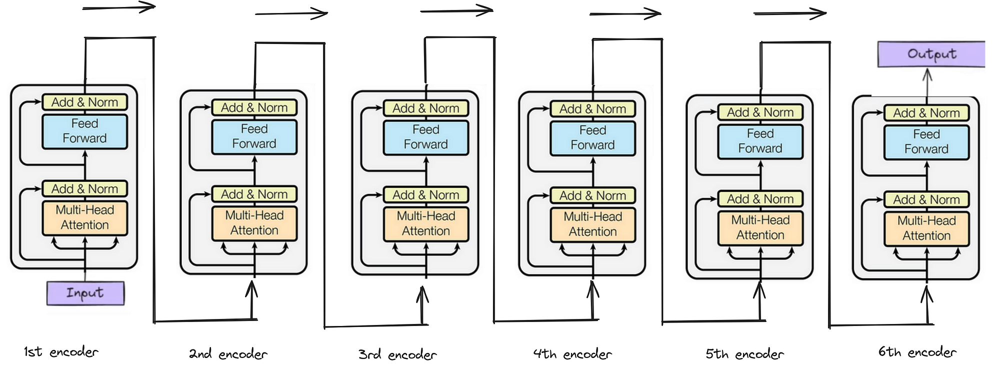
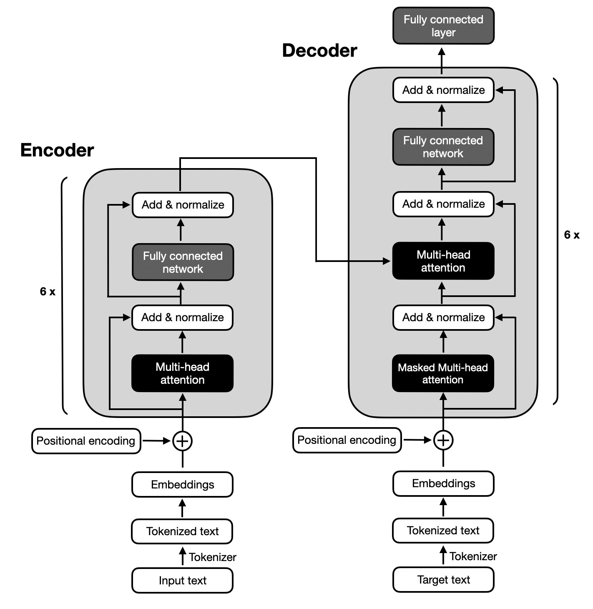

# 1. Overview of the Encoder

The Transformer encoder processes an input sequence and produces **context-aware representations** for each token.

Example sentence:

I love deep learning

After passing through the encoder, each word becomes a **contextual embedding** that understands relationships with other words.

The encoder consists of **multiple identical layers (blocks)** stacked together.

In the original :contentReference[oaicite:0]{index=0}, the encoder uses:

6 identical encoder blocks

### 1.2. Why 6 Encoder Blocks?

The number **6 is not a strict rule**. It was chosen in the original paper as a **balance between performance and computation**.

Reasons for stacking multiple blocks: 

**Deeper Understanding and filtered data**

Each layer refines the representation.

Example:

Layer 1 

captures basic word relationships.

Layer 3 

captures phrase-level relationships.

Layer 6  

captures complex semantic relationships.

**Progressive Context Learning**

Example sentence:

The bank near the river closed

Early layers may focus on **local word relations**, while deeper layers learn **full sentence meaning**.

**Model Capacity**

More layers allow the model to learn **more complex patterns**.

Modern models often use:

- 12 layers
  
- 24 layers
  
- 96+ layers (large models)

### 1.3. Structure of One Encoder Block

Each encoder block contains two main sublayers:

1. Multi-Head Self Attention

2. Feed Forward Neural Network

Each sublayer is wrapped with:

Residual Connection + Layer Normalization

Structure:

Input
↓
Multi-Head Self Attention
↓
Add & LayerNorm
↓
Feed Forward Network
↓
Add & LayerNorm
↓
Output

**1. Self-Attention in Encoder**

Self-attention allows each word to **look at other words in the sentence**.

Example sentence:

The animal didn't cross the street because it was tired

To understand **"it"**, the model must look at:

animal

Self-attention computes relationships between words.

Attention Computation

Each input embedding is transformed into:

Query (Q)

Key (K)

Value (V)

Using linear projections:

Q = XW_Q

K = XW_K

V = XW_V

Where:

X = input embeddings

W_Q, W_K, W_V = weight matrices

Attention scores:

Attention(Q,K,V) = softmax( (QKᵀ) / √d_k ) V

Steps:

1. Compute similarity between queries and keys.
   
2. Apply softmax to get attention weights.
   
3. Multiply weights with value vectors.

This produces **context-aware representations**.

**2. Feed Forward Neural Network (FFN)**

After attention, each token representation passes through a **position-wise feedforward network**.

Structure:

FFN(x) = max(0, xW₁ + b₁)W₂ + b₂

Typically:

d_model → d_ff → d_model

Example:

512 → 2048 → 512

This means:

1. expand dimension
2. apply non-linearity
3. project back

Why Feed Forward Network is Needed?

Self-attention mixes information between tokens, but it is mostly **linear operations**.

The feedforward network adds: non-linearity

Benefits:

- increases model capacity
  
- learns complex transformations
  
- enriches token representations

Example:

Attention tells the model:

which words are related

Feedforward learns:

how to transform the information

#### 2. Residual Connections

Each sublayer uses a residual connection:

Output = LayerNorm( x + Sublayer(x) )

Why residual connections are needed:

**1. Prevent Vanishing Gradients**

Deep networks often suffer from gradient problems.

Residual connections allow gradients to **flow directly through layers**.

**2. Preserve Original Information**

Even if a layer learns poorly, the model can still access the **original input**.

**3. Faster Training**

Residual connections help deep models train **more efficiently**.

#### 3. Why Multiple Encoder Blocks?

Stacking encoder layers helps the model build **hierarchical representations**.

Example sentence:

The boy playing football scored a goal

Layer understanding:

Layer 1  

learns word relationships.

Layer 3  

learns phrase structure.

Layer 6  

understands full sentence meaning.

Each layer improves the representation.

#### 4. Final Encoder Pipeline

Full encoder pipeline:

Input tokenization

↓

Word Embedding

↓

Positional Encoding

↓

Encoder Block × N (e.g., 6)

├─ Multi-Head Self Attention

├─ Add & LayerNorm

├─ Feed Forward Network

└─ Add & LayerNorm
↓
Contextual Token Representations

The encoder transforms input tokens into **rich contextual representations** by repeatedly applying:

attention (interaction between tokens)
+
nonlinear transformation (feedforward network)
