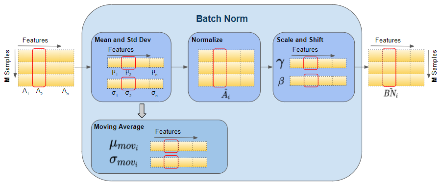

# 1. Why Normalization is Needed in Deep Neural Networks

When training deep neural networks,the **distribution of activations changes during training** as weights update.

This causes several problems:

- unstable gradients
  
- slow convergence
  
- exploding activations
  
- vanishing gradients.

Mean = 5.0

[5.1, 5.0, 4.9, 5.2, ...] ← All positive, all around 5

All activations are positive!The next layer's neurons only see positive inputs.

What happens?

All weights in the next layer will move in the same direction during updates

Learning becomes a zigzag pattern instead of direct path

Slower convergence.

With Mean=0:

[-1.2, 0.3, -0.8, 1.1, 0.2, -0.4] ← Mix of positive and negative
Neurons see balanced input, can learn more efficiently.

This phenomenon is often referred to as **internal covariate shift**.

**Internal Covariate Shift** = When the inputs to a layer keep changing their statistical distribution during training because previous layers' weights are updating.

Simple Example:

Layer 1 outputs to Layer 2:

Batch 1: Layer 1 outputs [1, 2, 1.5]  ← Mean ≈ 1.5

After weight update:

Batch 2: Layer 1 outputs [5, 6, 5.5]  ← Mean ≈ 5.5 (SHIFTED)

Layer 2 sees completely different numbers now.

The Problem: Layer 2 has to constantly adapt to new input patterns, like trying to hit a moving target. This slows training and requires careful learning rate tuning.

The Solution:Normalization (Batch Norm, Layer Norm) forces inputs to stay stable (mean≈0, variance≈1) so all layers see consistent patterns throughout training and between suppose [-1,1]

Normalizer forces: [1.5, 2.2, 0.8, 3.1] → [-0.5, 0.3, -1.2, 1.4]

Now stable range.

Layer 2 sees consistent [-1 to +1] range regardless of Layer 1's changes!

To stabilize training, researchers introduced **normalization techniques**.

Two popular methods:

- **Batch Normalization (BN)**
  
- **Layer Normalization (LN)**

#### 1.1 Batch Normalization (BN)

Batch Normalization normalizes activations using the **mean and variance computed across the mini-batch**.

For each feature in a batch:

1. Calculate batch mean and variance
   
2. Normalize: (input - batch_mean) / √(batch_variance)
   
3. Scale and shift: γ × normalized + β (learnable)
   
- **γ (gamma)** → learnable scale parameter  
  
- **β (beta)** → learnable shift parameter  

These allow the network to adjust the normalized output if needed.

Example of Batch Normalization

Input Batch (3 samples, 2 features)

[
 [1.0, 100.0],   # Sample 1

 [2.0, 50.0],    # Sample 2

 [3.0, 150.0]    # Sample 3
]

Feature 1: [1.0, 2.0, 3.0]

Mean = (1+2+3)/3 = 2.0

Variance = ((1-2)²+(2-2)²+(3-2)²)/3 = 0.67

Normalized:

1.0 → (1.0-2.0)/√0.67 = -1.22

2.0 → (2.0-2.0)/√0.67 = 0

3.0 → (3.0-2.0)/√0.67 = 1.22

BatchNorm calculates statistics **across the batch**.

Then every value is normalized.

###### 1.1.1. Why BatchNorm Works Well for Tabular Data

Tabular datasets have **independent samples**.

Example dataset:

Person1 → age, income

Person2 → age, income

Person3 → age, income

If we shuffle rows:

Person3

Person1

Person2

The meaning of the data **does not change**.Therefore computing statistics across the batch is **safe**.As all sample's feuture is same and don't need to padding with 0.All input length remain same.so, mean remain actual representation of that batch.

BatchNorm works very well for:

- tabular data
  
- feedforward neural networks
  
- computer vision (CNNs)

###### 1.1.2 The Problem: Why BatchNorm Fails for Sequential Data

Sequential data has **temporal dependency**.

Example sentence:

I love deep learning

Word meaning depends on order:

I → love → deep → learning

In sequence models:

h_t = f(x_t, h_{t-1})

Each state depends on previous states.

**Problem-1 Mixing Information Between Sequences**

Example batch:

Sentence1: I love NLP

Sentence2: Dogs eat food

BatchNorm computes statistics using **all tokens in the batch**.

Example values:

I = 2

love = 8

NLP = 6

Dogs = 10

eat = 12

food = 14

Batch mean:

mean = (2 + 8 + 6 + 10 + 12 + 14) / 6

Now normalization of **"I"** depends partly on:

Dogs, eat, food

This mixes information between unrelated sequences.

**Problem 2: Variable Sequence Length**

Sentences have different lengths.

Example:

Sentence1 length = 4

Sentence2 length = 10

Sentence3 length = 7

BatchNorm struggles because statistics vary across time steps.And for making all sequence same lenth, we have to padd with 0 and make all length 10.Then if we find mean of a batch(column) that won't be true representation of the data because of many 0 value.

**Problem:3 Small Batch Size in Large Models**

Large models (like modern Transformers) often use **very small batch sizes** due to GPU memory limits.

BatchNorm requires **large batches** to compute reliable statistics.

Small batch → noisy mean/variance.

#### 1.2 The Solution: Layer Normalization (LN)

Layer Normalization was proposed to solve these problems.

Instead of computing statistics across the batch, LN computes statistics **across the features of a single sample**.Layer Normalization normalizes activations across the feature dimension for each individual sample, independently of other samples in the batch.

Layer Normalization Equation

Layer Norm Formula:

output = ((input - μ) /(σ)) × γ + β

Where:

- μ = mean calculated across features (for one sample)
  
- σ² = variance calculated across features (for one sample)
  
- γ, β = learnable parameters (per feature)

**Simple Example of LayerNorm**

mean = average of these numbers

variance = spread of these numbers

Then normalizes them.

Input Batch (3 samples, 4 features each)

Batch = [

 [2.0, 4.0, 6.0, 8.0],    # Sample 1

 [1.0, 3.0, 5.0, 7.0],    # Sample 2

 [0.0, 2.0, 4.0, 6.0]     # Sample 3
]

Layer Normalization (Per Sample, Across Features)

Sample 1: [2.0, 4.0, 6.0, 8.0]

μ₁ = 5.0, σ₁ = 2.236

Normalized₁ = [-1.34, -0.45, 0.45, 1.34]

Sample 2: [1.0, 3.0, 5.0, 7.0]

μ₂ = 4.0, σ₂ = 2.236

Normalized₂ = [-1.34, -0.45, 0.45, 1.34]

Sample 3: [0.0, 2.0, 4.0, 6.0]

μ₃ = 3.0, σ₃ = 2.236

Normalized₃ = [-1.34, -0.45, 0.45, 1.34]

Final Output

After Layer Norm:

[
 [-1.34, -0.45, 0.45, 1.34],    # Sample 1

 [-1.34, -0.45, 0.45, 1.34],    # Sample 2

 [-1.34, -0.45, 0.45, 1.34]     # Sample 3
]

Notice: Each sample has the same normalized pattern but different original values!
This process **does not depend on other words or sentences**.

#### 1.3 Why Transformers Need LayerNorm

Transformers rely heavily on two mechanisms.

**Residual Connections**

Transformers add input and output:

y = x + Sublayer(x)

Without normalization, values could grow larger and larger across layers.

LayerNorm stabilizes these values.

**Attention Stability**

Self-attention uses dot products:

QK^T

Large values can push softmax into extreme regions.

This leads to **vanishing gradients**.

LayerNorm keeps values within a stable range.

#### 1.4 Benefits of LayerNorm in Transformers

### 1. Works with Sequential Data

Normalization does not mix sequences.

**Independent of Batch Size**

Works even with batch size = 1.

**Handles Variable Sequence Length**

Normalization happens inside each token.

**Stable Deep Architectures**

Prevents exploding activations across many layers.

