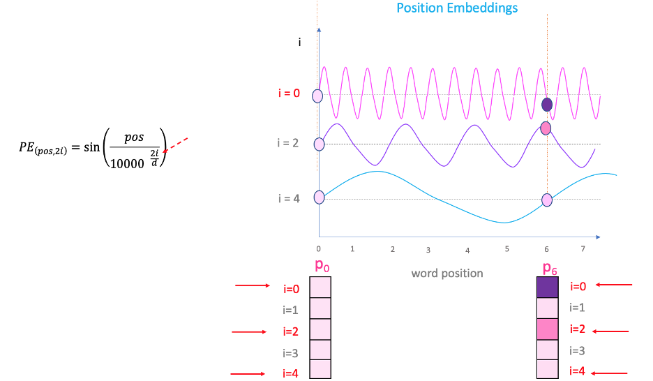

# 1.Positional Encoding (Transformer)

### 1.1 Why Do We Need Positional Encoding?

In the Transformer architecture,**self-attention processes all words in parallel.** Because of this, the model does **not know the order of words in a sentence**.

Example:

Sentence 1:

I love NLP

Sentence 2:

NLP love I

Without position information, both sentences would look almost the same to the model.

Therefore, we need a way to **add position information to word embeddings**.

##### Step 1: Naive Idea — Use Position Numbers

The first idea could be to add simple position numbers.

Example:

| Word | Position |
|----- |  ------|
| I    |   1 |
| love |   2 |
| NLP  |   3 |

But this approach has problems:

1. **Large position values**

For long sequences:

position = 100000

Adding such large numbers to embeddings can destabilize learning.nn and backpropagation hate large numbers and can't give stable result.

2. **Discrete representation**

Positions like 1,2,3 do not express **smooth relationships** between positions.

3. **No relative position information**

The model cannot easily understand patterns like:

pos + 1

pos + 2

##### Step 2: Use Periodic Functions

To solve this, we use **continuous periodic functions** such as:

- sine
  
- cosine

Periodic functions are useful because:

- they produce **bounded values (-1 to 1)**
  
- they naturally represent **patterns and distances**

##### Step 3:Create Position Vectors

Instead of using a single number, each position gets a **vector representation**.if we only find position by sin(pos)[scalar] it would be a problem because sin function periodic and 2 words can represent in the embedding same position number which is ambigous.so, we take sin and cos for making a vector representation such that repeat problem can be solved.

Example:

position → [sin(pos), cos(pos)]

This creates a **continuous positional representation**.

##### Step 4: Expand to Higher Dimensions

Since word embeddings have many dimensions (e.g., 512), positional encoding also uses many dimensions.

Each pair of dimensions uses a different frequency.By increasing position number ,the frequency of value remain unchanged/decreased.

Formula:

PE(pos, 2i) = sin(pos / 10000^(2i / d_model))

PE(pos, 2i+1) = cos(pos / 10000^(2i / d_model))

Where:

- `pos` = position in the sequence of a word
  
- `i` = dimension index 
  
- `d_model` = embedding dimension

This creates a **unique position vector for every position**.

we make every position vector which size= word embedding size and then add with it for making contexual+position of a word.

##### Step 5: Combine with Word Embedding

Two options exist:

1. **Concatenation**

[word_embedding ; position_vector]

Problem:

- increases vector dimension
  
- increases computation(parameters increases) and training time.

2. **Addition (Used in Transformers)**

final_embedding = word_embedding + positional_encoding

Addition keeps the **same dimension** and allows the model to learn both **word meaning and position** together.

Positional encoding allows the Transformer to understand **word order** while keeping the benefits of **parallel processing**.

By using **sinusoidal functions**, each position gets a unique and continuous representation that helps the model learn **relative positions and sequence patterns**.

### 1.2 Why Sinusoidal Positional Encoding Helps Learn Relative Positions?

An important property of sinusoidal positional encoding is that it allows the model to easily learn **relative positions** between words.It can make continous values between [-1,1] which is very important for neural network and back propagation.

Example:

If the model knows the encoding for position `pos`, it can compute the encoding for `pos + k` using simple linear relationships between sine and cosine values.

This happens because sine and cosine functions follow predictable patterns:

sin(a + b) and cos(a + b) can be expressed using sin(a), cos(a), sin(b), and cos(b).

Because of this property, the model can easily learn patterns like:

- next word → `pos + 1`
  
- two words later → `pos + 2`

This helps the Transformer understand **relative distances between words**, which is important for tasks like translation and language understanding.

Sinusoidal positional encoding allows the model to capture both:

- **absolute position** of a word
- **relative position** between words

without needing extra parameters to learn positions.

Each bit changes at different speeds:

- last bit → every step  
  
- next bit → every 2 steps 
   
- next bit → every 4 steps  

Similarly, positional encoding uses sinusoidal waves with different frequencies so that each position can be uniquely represented.

### 1.3 Why Use Both High and Low Frequencies in Positional Encoding

In positional encoding, different dimensions use sinusoidal waves with different frequencies.

High-frequency dimensions change rapidly, while low-frequency dimensions change slowly.

This provides two important benefits:

1. **Local Position Awareness**

High-frequency waves change quickly across positions.  
This helps the model detect small position differences such as neighboring words.

Example: detecting relationships like "not good".

2. **Global Position Awareness**

Low-frequency waves change slowly across positions.  
This helps the model understand the overall position of words in long sequences (beginning, middle, end).

By combining multiple frequencies, positional encoding provides **multi-scale positional information**, allowing the Transformer to understand both **local word relationships and global sentence structure**.

