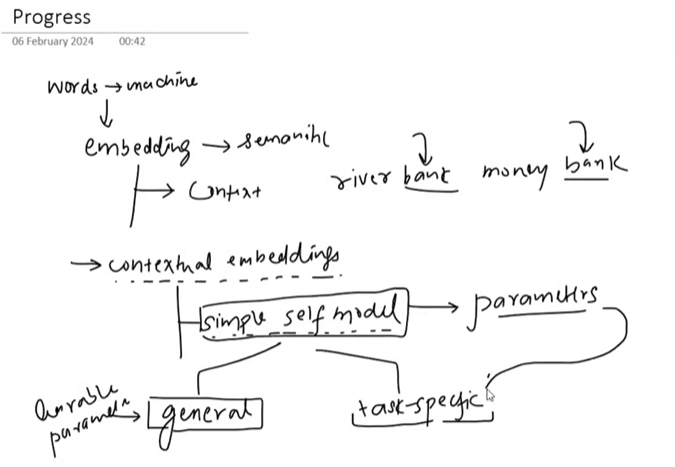

## 1.Self-Attention

Self-attention is a mechanism used in the Transformer architecture that allows each word in a sentence to consider and weigh the importance of all other words when forming its representation.It allows a model to look at all other words in a sentence to gain a better understanding of the current word. It answers the question: "Which parts of the input sequence should I pay more attention to right now?"

In simply, Self attention is a mechanism which takes static embeddings as input and can generate good dynamic contexual embeddings that are much better to use for any kind of NLP application.

Instead of processing words sequentially like RNNs or LSTMs, self-attention examines the relationships between all words in the sequence simultaneously. This helps the model understand context and long-distance dependencies more effectively.

Imagine you are reading the sentence: "The animal didn't cross the street because it was too tired."
When you read the word "it," you instinctively link it to "animal" (not "street"). Self-attention is the mathematical process that teaches the computer to do the same thing. It calculates the context of a word based on its relationship with every other word in the sequence.

### Example

Sentence:

"I love deep learning"

When processing the word "love", self-attention evaluates its relationship with:

- "I"
  
- "love"
  
- "deep"
  
- "learning"

Each word receives an **attention weight** that indicates how important it is for understanding the current word. The model then combines these weighted representations to produce a **context-aware vector**.

Self-attention allows a model to focus on the most relevant words in a sentence when computing the meaning of each word.

### 1.1 Static vs Contextual Embeddings

Word embeddings convert words into numerical vectors so that machine learning models can process text.

#### Static Embeddings
Static embeddings assign **one fixed vector to each word**, regardless of the context in which it appears.

Example:

The word **"bank"** will always have the same vector whether it appears in:

- "I deposited money in the bank"
  
- "The boat reached the river bank"

Common static embedding methods:

- Word2Vec
  
- GloVe
  
- FastText

**Limitation:**  

They cannot capture different meanings of a word in different contexts which was used in lstm/RNN.

### Contextual Embeddings

Contextual embeddings generate **different vectors for the same word depending on the sentence context** which is used in transformer self attention.

Example:

Word **"bank"**:

- "I deposited money in the bank" → financial institution
  
- "The boat reached the river bank" → edge of a river

The embedding changes because the surrounding words are different.

Common contextual embedding models:

- BERT
  
- GPT
  
- Transformer-based models

Static embedding:

love → same vector everywhere

Contextual embedding:

"I love pizza"   → love = positive food context

"I love coding"  → love = programming context

## 1.2 The Problem with Early Attention

To understand this problem, we need to look at how word understanding evolved in NLP models.

#### 1. Static Embeddings (Old Approach)

In early NLP models, each word had **one fixed vector**, regardless of the sentence.

Example:
Word: **apple**

The model always uses the same representation for:

- "I ate an apple."
  
- "Apple released a new iPhone."

Problem:  

The model cannot clearly distinguish the meaning of the word from context.

Common static embedding methods:

- Word2Vec
  
- GloVe

#### 2. Contextual Embeddings (First Improvement)

Later models introduced **contextual embeddings**, where the meaning of a word changes depending on the sentence.

Example:

Sentence 1: 

"I ate an apple." → apple = fruit  

Sentence 2:  

"Apple released a new phone." → Apple = company  

Now the model looks at **surrounding words** to adjust the meaning of the word.

This was a major improvement.

#### 3. Limitation of Early Attention

Even though contextual embeddings understand the **general meaning of the sentence**, they do not always focus on the **important words for a specific task**.

Example (Sentiment Analysis):

Sentence:

"The movie was unexpectedly good."

General understanding:

The model understands the relationship between **unexpectedly** and **good**.

But for **sentiment analysis**, the most important word is:

**"good"**

Words like:
- the,
- was,
- unexpectedly

are less important for detecting sentiment.

So the problem is:

The model may focus on grammatical relationships instead of the words that matter for the specific task.

Early attention helped models understand **context**, but it did not always focus on the **most important words for the task**.

Later improvements in attention mechanisms helped models learn **which words are most relevant for a specific task**.

#### 4.The Final Simple Example

Let's take the sentence: "The bank of the river was muddy."

**General Contextual Embedding (Reading the file):**

The model looks at all the words. It sees "bank" next to "river." It correctly understands that "bank" here means the side of a river, not a financial bank. It has solved the ambiguity. This is the "general" part. It understands the sentence.

**Task-Specific Need (Solving the crime):**

Task A (Ecology research): You want to know about animal habitats. The model needs to pay specific attention to "muddy" because that implies animal footprints or moisture.

Task B (Geology research): You want to know about river erosion. The model needs to pay specific attention to "bank" and "river" to understand the landform.

Task C (Safety research): You want to know if the area is dangerous. The model needs to pay specific attention to "muddy" because that could mean slippery.

The "limitation of early attention" was that it stopped at Step 1.It understood the sentence, but it didn't know that for your research, the most important word is "muddy" (or "bank"). It treated all words with equal importance after understanding the context.

## 1.3.From General Attention to Task-Focused Attention

Early attention helped models understand general context in a sentence. 

However, for many NLP tasks (like translation or sentiment analysis), the model needs to focus on **specific important words** instead of treating all words equally.

Transformers solve this task-focus problem using **Self-Attention with Query, Key, and Value vectors**.

## Query, Key, and Value (Q, K, V)

In a Transformer, each word embedding is transformed into three vectors:

- **Query (Q)** → What this word is looking for
  
- **Key (K)** → What this word contains
  
- **Value (V)** → The actual information of the word

You can think of it like a search system:

- Query = question
  
- Key = labels of stored information

- Value = the actual content

**Simple Example**

Sentence:

I love deep learning

Suppose we want to compute the attention for the word **"love"**.

#### Step 1: Create Q, K, V

Each word embedding is converted into:

I → Q1, K1, V1

love → Q2, K2, V2

deep → Q3, K3, V3

learning → Q4, K4, V4

#### Step 2: Compute Attention Scores

The model compares the **Query of "love"** with the **Keys of all words**.

score(love, I)

score(love, love)

score(love, deep)

score(love, learning)

This is usually done with a **dot product**:

score = Q · K

Higher score = more relevance.

#### Step 3: Convert Scores to Weights

Scores are normalized using **Softmax** so they become attention weights.

Example:

| Word | Attention Weight |

|-----|------------------|

| I | 0.3 |

| love | 0.4 |

| deep | 0.1 |

| learning | 0.2 |

These weights tell the model **which words are more important**.

#### Step 4: Compute the Context Vector

The model multiplies each **Value vector** by its attention weight.

context(love) =

0.3 × V(I)

0.4 × V(love)

0.1 × V(deep)

0.2 × V(learning)

This produces a **contextual representation of "love"** that includes information from other relevant words.

#### Why This Helps with Tasks

Different tasks naturally produce different attention patterns.

Example:

Sentence:

The movie was unexpectedly good

For **sentiment analysis**, attention will focus more on:

good

For **grammar understanding**, attention may focus on:

unexpectedly → good

So the model learns automatically which words are important for the task during training.

Self-attention uses **Query, Key, and Value** to measure how much each word should focus on other words.  

This allows Transformers to create **task-relevant contextual embedding.

## 1.4 How Query,key,value(3 extra vectors solved the problem)

Sentence:

The animal didn't cross the street because it was too tired.

Goal: understand what "it" refers to.

**1. Very Old NLP Models (Before Attention)**

Early models used RNN / LSTM like Long Short-Term Memory.

How they worked:

Read sentence word by word

Store information in a hidden state

The final hidden state represents the whole sentence

Example process:

The → h1

animal → h2

didn't → h3

cross → h4

tired → hN

Problem:

When the model reaches "it", the important word "animal" appeared many steps earlier.

RNNs struggle with long-distance relationships.

So the model may forget that animal is the correct reference.

**2. Attention (Before Transformers)**

To solve this, attention was introduced.

Idea:

When predicting "it", the model looks back at all words.

So we compute scores:

score(it , animal)
score(it , street)
score(it , tired)

Like you said, animal might get highest score.

So yes — sometimes this works.

But there are two main problems.

**3. Problem 1 — Same Vector Doing Two Jobs**

Without QKV, the same embedding vector is used for:

asking for information

providing information

Example:

embedding(it)

embedding(animal)

embedding(street)

Now we compute:

similarity(embedding(it), embedding(animal))

But the embedding of "animal" was not designed specifically to answer questions.

It is just a general representation.

So the model cannot clearly learn:

how a word asks

how a word responds

Everything uses the same vector.

**4. Problem 2 — What If the Word Needs Different Types of Information?**

Example sentence:

The bank approved the loan because it was profitable

"it" could refer to:

bank

loan

But why it refers depends on context type.

Maybe:

financial meaning

grammar role

semantic relation

If we only use one embedding, it cannot represent all these roles well.

**5. What Transformers Changed**

The architecture Transformer introduced three different projections.

Each word embedding is transformed into:

Query,
Key,
Value

Instead of using one vector.

**6. Why This Helps**

Now each word has three roles.

Example word: animal

embedding → base meaning

Key → description of what this word represents

Value → actual information passed to others

For it:

Query → what type of word am I searching for?

**7. Now Attention Works Like This**

For word it:

Step 1

Q_it

Step 2 compare with keys:

Q_it ⋅ K_animal

Q_it ⋅ K_street

Step 3 choose highest score.

Step 4 combine values to build context.

**Without QKV:**

embedding(it) ⋅ embedding(animal)

Same vector does everything.

**With QKV:**

Query(it) ⋅ Key(animal)

Roles are separated.

This allows the model to learn:

how words search for information

how words describe themselves

how words share information

1. One Simple Analogy

Imagine asking a question in a classroom.

Without QKV:

Everyone just shows their identity card.

With QKV:

Query → the question

Key → what each student knows

Value → the answer they provide

Now matching becomes much clearer.

Transformers separate asking (Query) from describing (Key) and providing information (Value), which makes learning relationships between words much easier than using one embedding for everything.

