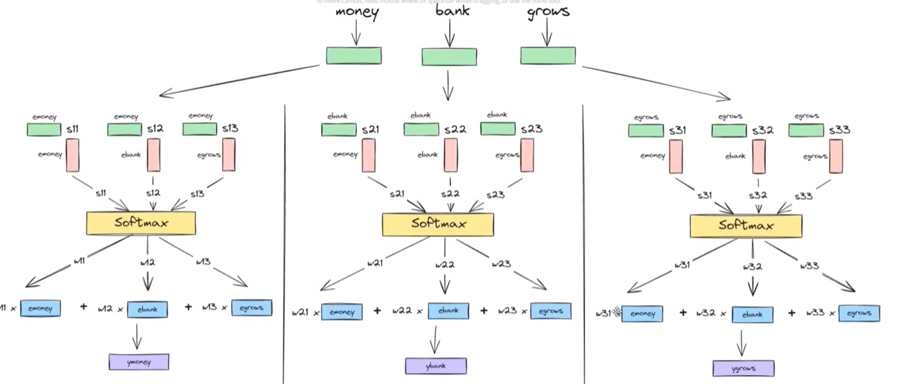

## 1.Self-Attention

Self-attention is a mechanism used in the Transformer architecture that allows each word in a sentence to consider and weigh the importance of all other words when forming its representation.It allows a model to look at all other words in a sentence to gain a better understanding of the current word. It answers the question: "Which parts of the input sequence should I pay more attention to right now?"

In simply, Self attention is a mechanism which takes static embeddings as input and can generate good dynamic contexual embeddings that are much better to use for any kind of NLP application.

Instead of processing words sequentially like RNNs or LSTMs, self-attention examines the relationships between all words in the sequence simultaneously. This helps the model understand context and long-distance dependencies more effectively.

Imagine you are reading the sentence: "The animal didn't cross the street because it was too tired."
When you read the word "it," you instinctively link it to "animal" (not "street"). Self-attention is the mathematical process that teaches the computer to do the same thing. It calculates the context of a word based on its relationship with every other word in the sequence.

### Example

Sentence:

"I love deep learning"

When processing the word "love", self-attention evaluates its relationship with:

- "I"
  
- "love"
  
- "deep"
  
- "learning"

Each word receives an **attention weight** that indicates how important it is for understanding the current word. The model then combines these weighted representations to produce a **context-aware vector**.

Self-attention allows a model to focus on the most relevant words in a sentence when computing the meaning of each word.

### 1.1 Static vs Contextual Embeddings

Word embeddings convert words into numerical vectors so that machine learning models can process text.

#### Static Embeddings
Static embeddings assign **one fixed vector to each word**, regardless of the context in which it appears.

Example:

The word **"bank"** will always have the same vector whether it appears in:

- "I deposited money in the bank"
  
- "The boat reached the river bank"

Common static embedding methods:

- Word2Vec
  
- GloVe
  
- FastText

**Limitation:**  

They cannot capture different meanings of a word in different contexts which was used in lstm/RNN.

### Contextual Embeddings

Contextual embeddings generate **different vectors for the same word depending on the sentence context** which is used in transformer self attention.

Example:

Word **"bank"**:

- "I deposited money in the bank" → financial institution
  
- "The boat reached the river bank" → edge of a river

The embedding changes because the surrounding words are different.

Common contextual embedding models:

- BERT
  
- GPT
  
- Transformer-based models

Static embedding:

love → same vector everywhere

Contextual embedding:

"I love pizza"   → love = positive food context

"I love coding"  → love = programming context

