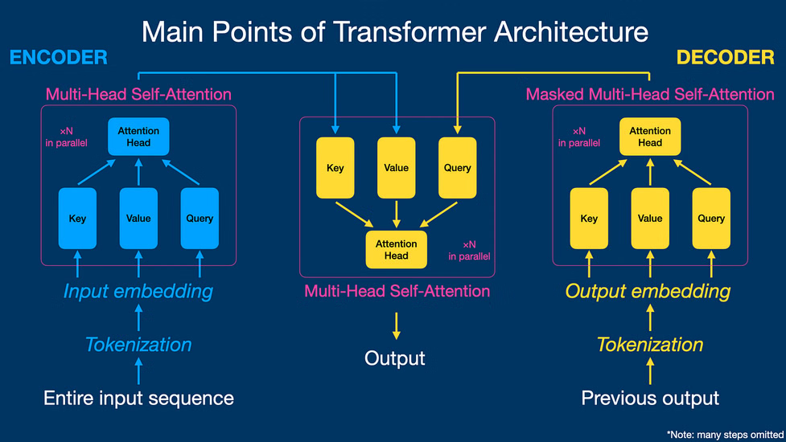
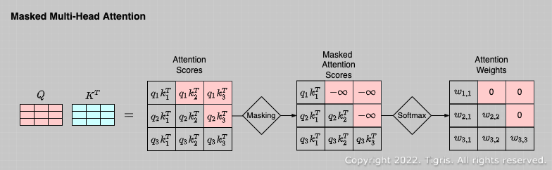

# Masked Multi-Head Attention (Decoder)

**Masked Multi-Head Attention** is a self-attention mechanism used in the **Transformer decoder** where **future tokens are hidden (masked)** so that each position can only attend to **previous tokens**.

This ensures the model predicts the **next word using only past words**, not future ones.

## Autoregressive Inference vs Non-Autoregressive Training

### Inference (Autoregressive)

During **prediction**, the model generates text **one token at a time**.It executes at the time of new prediction. When we want to predict by giving validation data then it works step by step(not parallel).

Example:

Sentence generation

Input: I love

Step 1

Model predicts → learning

Sentence becomes

I love learning

Step 2

Model predicts → models

Sentence becomes

I love learning models

Each new word is predicted using **previously generated words**.

So inference is **autoregressive**.

Mathematically:

P(x1, x2, x3, ..., xn)

= P(x1) × P(x2|x1) × P(x3|x1,x2) ...

### Training (Non-Autoregressive Computation)

During **training**, the full sentence already exists in the dataset.

Example sentence:

I love deep learning

The model predicts all tokens simultaneously:

| Input | Target |

|------|------|

| `<START>` | I |

| I | love |

| I love | deep |

| I love deep | learning |

Because the whole sequence is available, the Transformer computes **all predictions in parallel**.

This makes training **much faster** using GPU parallelism.

## The Problem: Data Leakage in Parallel Training

Since the **entire sentence is available**, the attention mechanism could see **future words**.

Example sentence:

I love deep learning

Suppose the model is predicting **love**.

Correct context should be:

But without masking, attention could see:

I love deep learning

So the model might learn:

love → attend to love

This is called **data leakage** because the model is using the **correct answer from the future**.

The model would not learn real language patterns.

### Why This Is a Problem

If the model learns from **future words**, it becomes dependent on information that **will not exist during inference**.

Training condition:

future words available

Inference condition:

future words unknown

So the model would fail during real text generation.

## How Masked Attention Solves the Problem

Masked attention **blocks future tokens**.

The attention matrix is modified so that a token can only attend to **itself and previous tokens**.

Example sentence:

I love deep learning

Attention visibility:

    I   love   deep   learning

I ✓ ✗ ✗ ✗

love ✓ ✓ ✗ ✗

deep ✓ ✓ ✓ ✗

learn ✓ ✓ ✓ ✓

Future tokens are hidden.

This keeps the training behavior consistent with **autoregressive inference**.

## How Masking Is Implemented (Adding −∞)

Self-attention uses the formula:

Attention(Q,K,V) = softmax(QKᵀ / √d) V

To block future tokens, a **mask matrix** is added before the softmax.

Example scores:

[2.3, 1.5, 0.7, 0.4]

After masking future positions:

[2.3, 1.5, -∞, -∞]

Softmax result:

[0.62, 0.38, 0, 0]

Because:

exp(-∞) → 0  So masked positions receive **zero attention weight**.

## Role of Multi-Head Attention

Instead of computing attention once, the Transformer uses **multiple attention heads**.

Each head learns **different relationships** in the sequence.

Example heads may learn:

Head 1 → grammatical structure  

Head 2 → semantic relations  

Head 3 → long-distance dependencies  

Each head performs masked attention independently:

head1 = Attention(Q1,K1,V1)

head2 = Attention(Q2,K2,V2)

Then outputs are concatenated:

MultiHead(Q,K,V) = Concat(head1, head2, ... headh) Wᵒ

This allows the model to capture **multiple contextual patterns simultaneously**.

## Final Intuition

Masked multi-head attention ensures:

- the model **cannot see future tokens**
  
- training remains **consistent with autoregressive inference**
  
- multiple heads learn **different contextual relationships**

In simple words:

> The decoder learns to **predict the next word using only previous words**, while still benefiting from **parallel training** and the training become fast.